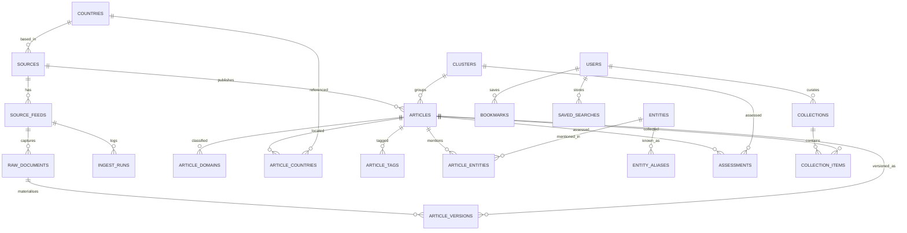

# CBRNE Intelligence Reading Room

Architecture and build plan.

---

## 0. Three constraints to settle before writing code

### 0.1 The one minute requirement cannot be met on GitHub Actions

GitHub caps scheduled workflows at a five minute minimum, and `* * * * *` is
silently dropped rather than rejected: the YAML lints, the schedule appears in
the UI, and nothing ever fires. Even at `*/5`, scheduled runs sit in a shared
global queue where delays of five to thirty minutes are routine and runs are
occasionally skipped without trace. Cron is best effort with no timing
guarantee.

Two further reasons the requirement is wrong even if the platform allowed it:

- **Upstream fair use.** GDELT, Europe PMC, Crossref, OpenAlex and NCBI all
  publish rate limits or fair use expectations. Polling dozens of queries every
  sixty seconds gets the deployment blocked, not rewarded.
- **Nothing changes that fast.** A journal indexing pipeline updates on the
  order of hours to days. Polling PubMed every minute returns the same rows
  1,440 times a day.

**What to build instead: tiered polling.**

| Tier | Cadence | Runtime | Content |
| --- | --- | --- | --- |
| 0 hot | 1 to 5 min | Cloudflare Worker cron, or a VPS systemd timer | Emergency alert feeds, national warning systems, a short allowlist of wire services |
| 1 warm | 15 min | same runtime | National press, agency newsrooms, GDELT sweep |
| 2 standard | 1 to 6 h | GitHub Actions or the same worker | Ministries, think tanks, NGO reporting |
| 3 cold | 12 to 24 h | GitHub Actions | OpenAlex, Europe PMC, Crossref, PubMed, patents, procurement |

Cloudflare Worker cron triggers do go down to one minute, so tier 0 is
genuinely achievable. It just must not live in GitHub Actions, and it must
cover a handful of endpoints rather than the whole source list. `poll_tier` on
`source_feeds` carries this per feed.

**GitHub holds the code. Postgres holds the data.** The kaf-bio pattern of
committing JSON to git works beautifully at four runs a day and collapses at
one run a minute: 525,600 commits a year would make the repository unusable.
This is why the stack you specified, Supabase and Postgres, is the right call
here and the git-as-database pattern is not.

### 0.2 This specification contradicts your own design position

Two turns ago you set the scope as collection only: no verification, no
analysis. This document asks for AI threat assessment, confidence score,
credibility score, bias estimation and priority score.

That is a legitimate thing to want. But it is the same construction you
correctly criticised in the World Monitor review, where an unvalidated
composite made the whole output uncitable. If a credibility score is computed
by a language model with unpublished weights and rendered as a bare number, an
institutional buyer will ask for the validation study, and there will not be
one.

The schema resolves this structurally rather than by argument:

- `assessments` is a separate table. It is never a column on `articles`.
- Every row requires `producer` (model id) and `prompt_version` (prompt git sha).
- Every row carries a `gaps` field stating what the model could not determine.
- Deleting every row in `assessments` loses nothing a source ever said.

So you can ship the AI features and still hand someone a clean archive. The UI
contract that goes with it: **no score renders without its producer and
timestamp beside it.** That single rule is what separates this from the
composite you criticised.

### 0.3 Scope of what follows

Items 1 to 11 of your output list are below and are complete. Item 12,
production ready source for the whole surface you described, is a multi month
build for a team: eight route groups, a boolean query parser, an entity
extraction pipeline across twenty entity kinds, per country pages, PWA offline
support. Nobody can hand you that as one artifact honestly.

What is real here: the schema is written and validated, the architecture is
decided, and the vertical slice to build first is identified. Say which module
to write next and it gets written properly rather than sketched.

---

## 1. System architecture

```
                        ┌───────────────────────────┐
                        │   Next.js 15 (App Router) │
                        │   TypeScript, Tailwind    │
   reader ──────────────│   shadcn/ui, React Query  │
                        │   RSC + ISR + PWA shell   │
                        └────────────┬──────────────┘
                                     │  REST + RPC
                        ┌────────────┴──────────────┐
                        │   API layer (route         │
                        │   handlers + Prisma)       │
                        └────────────┬──────────────┘
                                     │
              ┌──────────────────────┴───────────────────────┐
              │            Postgres (Supabase)               │
              │  capture: raw_documents, article_versions    │
              │  canonical: articles, entities, clusters     │
              │  interpretation: assessments (separable)     │
              │  observability: ingest_runs, collection_gaps │
              └──────────────────────┬───────────────────────┘
                                     │
        ┌────────────────────────────┼────────────────────────────┐
        │                            │                            │
┌───────┴────────┐         ┌─────────┴─────────┐        ┌─────────┴────────┐
│ Collector      │         │ Enricher          │        │ Assessor         │
│ FastAPI +      │         │ deterministic     │        │ LLM, queued,     │
│ httpx +        │         │ regex, gazetteers,│        │ idempotent,      │
│ feedparser +   │         │ NER, dedup,       │        │ fully optional   │
│ Playwright     │         │ clustering        │        │                  │
│ tiers 0-3      │         │ no model calls    │        │ writes only to   │
└────────────────┘         └───────────────────┘        │ assessments      │
                                                        └──────────────────┘
```

The three workers are separate processes on purpose. The enricher must be able
to run with the assessor switched off entirely, and the reading room must stay
fully functional in that state. That is the testable expression of section 0.2.

---

## 2. Folder structure

```
cbrne-reading-room/
├── apps/
│   ├── web/                        Next.js 15
│   │   ├── app/
│   │   │   ├── (reader)/
│   │   │   │   ├── page.tsx                  home stream
│   │   │   │   ├── article/[id]/page.tsx     reader view
│   │   │   │   ├── country/[iso2]/page.tsx
│   │   │   │   ├── domain/[domain]/page.tsx  C B R N E cyber health industry
│   │   │   │   ├── source/[slug]/page.tsx
│   │   │   │   ├── entity/[id]/page.tsx
│   │   │   │   └── search/page.tsx
│   │   │   ├── (workspace)/
│   │   │   │   ├── bookmarks/page.tsx
│   │   │   │   ├── collections/[id]/page.tsx
│   │   │   │   ├── saved/page.tsx
│   │   │   │   └── briefs/[period]/page.tsx  daily weekly monthly
│   │   │   ├── (ops)/
│   │   │   │   ├── sources/page.tsx
│   │   │   │   └── gaps/page.tsx             collection gaps
│   │   │   └── api/
│   │   │       ├── articles/route.ts
│   │   │       ├── search/route.ts
│   │   │       ├── entities/route.ts
│   │   │       └── export/[format]/route.ts
│   │   ├── components/
│   │   │   ├── reader/       ArticleBody, ReadingProgress, FocusMode
│   │   │   ├── stream/       ArticleRow, VirtualList, FilterBar
│   │   │   ├── entity/       EntityChip, EntityPanel, NetworkGraph
│   │   │   ├── assessment/   AssessmentCard  (renders producer + timestamp)
│   │   │   └── ui/           shadcn primitives
│   │   ├── lib/
│   │   │   ├── query/        boolean + regex parser, AST types
│   │   │   ├── api/          typed client, React Query hooks
│   │   │   └── export/       md, csv, json, ris, bibtex, pdf
│   │   └── public/           manifest.json, sw.js
│   └── ingest/                     Python service
│       ├── main.py                 FastAPI, health + manual trigger
│       ├── scheduler.py            tier loop
│       ├── collectors/
│       │   ├── rss.py  atom.py  sitemap.py  scrape.py
│       │   ├── openalex.py  europepmc.py  crossref.py  pubmed.py
│       │   └── gdelt.py
│       ├── enrich/
│       │   ├── dedup.py            simhash + url canonicalisation
│       │   ├── cluster.py          embedding + agglomerative
│       │   ├── extract_regex.py    CAS, UN number, HS code, isotope
│       │   ├── gazetteer.py        pathogens, facilities, organisations
│       │   └── readability.py      body text extraction
│       ├── assess/
│       │   ├── runner.py           queue consumer, idempotent
│       │   └── prompts/            versioned, git sha is the version
│       └── tests/                  fixture based, no network
├── packages/
│   ├── db/                   Prisma schema + migrations
│   └── types/                shared TS types generated from Prisma
├── db/
│   ├── schema.sql            authoritative DDL
│   └── seed/                 countries, source registry, gazetteers
├── docker/
│   ├── Dockerfile.web
│   ├── Dockerfile.ingest
│   └── docker-compose.yml
└── docs/
    ├── ARCHITECTURE.md       this file
    ├── SOURCES.md            source registry with licence per source
    └── PUBLICATION_POLICY.md what is indexed and what is never indexed
```

---

## 3. Database schema

See `db/schema.sql`. Twenty one tables, one view, validated as Postgres DDL.

Design points worth stating explicitly:

- **`raw_documents` is immutable.** One row per successful fetch. Never updated
  by application code. Bodies offload to object storage above a size threshold.
- **`article_versions` appends.** An upstream edit produces a new version row
  with a diff summary. This is "archive every version".
- **`article_entities` carries character offsets.** An entity table without
  offsets is an unfalsifiable claim. With them, every extraction is traceable
  to the exact span that produced it.
- **`ingest_runs` records failures, not just successes.** This is what makes
  "we saw nothing" a defensible statement rather than an ambiguous one, and it
  is what the `collection_gaps` view reads.
- **`sources.state_affiliated` and `peer_reviewed` are descriptive.** They
  record what kind of body publishes, not how much to trust it. Never render
  them as a ranking.

---

## 4. ER diagram



---

## 5. UI wireframes

**Home stream.** Reading column capped at 850px, sidebar outside it.

```
┌────────────────┬──────────────────────────────────────────────┬──────────┐
│ WORLD          │  CBRNE Intelligence Reading Room             │ 14:02Z   │
│ Countries      │  ┌────────────────────────────────────────┐  │          │
│ Organizations  │  │ / search   boolean, regex, entity:     │  │          │
│ Threat cats    │  └────────────────────────────────────────┘  │          │
│   Chemical     │  country ▾  domain ▾  source ▾  date ▾  lang ▾          │
│   Biological   │                                                          │
│   Radiological │  ──────────────────────────────────────────────         │
│   Nuclear      │  14:02Z  OPCW          NL   [C]                          │
│   Explosive    │  Headline set in Source Serif, 19px, 1.35                │
│   Cyber        │  ──────────────────────────────────────────────         │
│   Health       │  13:47Z  Europe PMC    --   [B] PRE                      │
│   Industry     │  Article title, same treatment                           │
│ Sources        │  ──────────────────────────────────────────────         │
│ Bookmarks      │  13:31Z  IAEA          AT   [N]                          │
│ Saved searches │  Headline                                                │
│ RSS sources    │  ──────────────────────────────────────────────         │
│ Collections    │                                                          │
│ Tags           │            ← 850px reading column →                      │
└────────────────┴──────────────────────────────────────────────┴──────────┘
```

**Article reader.** Entities in a right rail that collapses in focus mode.

```
┌────────────────────────────────────────────┬────────────────────┐
│ ← back                        ⌘F focus  ⌘B │  ENTITIES          │
│                                            │                    │
│ Source · Country · 2026-07-22 · 4 min read │  Organizations     │
│                                            │   OPCW             │
│ Headline, Source Serif 32px                │   TNO              │
│                                            │  Chemicals         │
│ Body text, Source Serif 19px, 1.7,         │   sarin  CAS 107-  │
│ measure held to 68 characters.             │   44-8             │
│                                            │  Countries         │
│ ┌────────────────────────────────────────┐ │   NL  SY           │
│ │ SUMMARY                                │ │  Hazard class      │
│ │ produced by claude-sonnet-4-6          │ │   UN 2810          │
│ │ prompt a3f19c2 · 2026-07-22T14:05Z     │ │                    │
│ │ gaps: casualty figures not stated      │ │  ─────────────     │
│ └────────────────────────────────────────┘ │  Related           │
│                                            │  Timeline          │
│ Original link ↗                            │  References        │
└────────────────────────────────────────────┴────────────────────┘
```

The summary card carries producer, prompt version, timestamp and gaps. That
frame is mandatory for every assessment surface in the app.

---

## 6. Component hierarchy

```
RootLayout
├── CommandPalette          ⌘K, routes + saved searches + entities
├── Sidebar
│   ├── NavSection ×7
│   └── ThemeToggle
└── ReaderShell (max-w-[850px])
    ├── FilterBar
    │   ├── FacetSelect ×6
    │   └── QueryInput → useQueryParser()
    ├── ArticleStream
    │   ├── VirtualList (tanstack/react-virtual)
    │   └── ArticleRow
    │       ├── TimeStamp  · SourceChip · CountryChip · DomainBadge
    │       └── Headline
    └── ArticleView
        ├── ArticleHeader
        ├── ArticleBody      → ReadingProgress, FocusMode
        ├── AssessmentCard   → producer, promptVersion, producedAt, gaps
        ├── EntityRail
        │   ├── EntityGroup ×n → EntityChip
        │   └── NetworkGraph (lazy, react-force-graph)
        ├── RelatedCluster
        └── ExportMenu       md · pdf · csv · json · ris · bibtex
```

---

## 7. API design

```
GET  /api/articles?domain=chemical&country=NL&from=&to=&cursor=&limit=50
GET  /api/articles/:id
GET  /api/articles/:id/versions
GET  /api/articles/:id/entities
GET  /api/articles/:id/assessments        ← always returns producer + gaps
GET  /api/clusters/:id

POST /api/search
     { "q": "(sarin OR VX) AND NOT exercise",
       "regex": false, "domain": ["chemical"], "country": ["SY"],
       "from": "2026-01-01", "cursor": null }
     → parsed to an AST, compiled to tsquery, never string-concatenated

GET  /api/entities?kind=chemical&q=sar
GET  /api/entities/:id/articles
GET  /api/countries/:iso2/summary

GET  /api/sources
GET  /api/ops/gaps                        ← collection_gaps view

POST /api/bookmarks        DELETE /api/bookmarks/:id
POST /api/saved-searches
GET  /api/export/:format?ids=…            md|pdf|csv|json|ris|bibtex

POST /internal/ingest/trigger             ← service token, tier param
```

Cursor pagination throughout, keyed on `(first_seen_at, id)`. Offset pagination
breaks under continuous insertion, which is the normal state here.

---

## 8. Ingestion pipeline

```
 tier loop (per poll_tier)
      │
      ▼
 conditional GET  ── 304 ──▶ log run, stop
      │ 200
      ▼
 raw_documents  (immutable insert, body_sha256)
      │
      ▼
 parse ── rss | atom | sitemap | json | scrape(Playwright)
      │
      ▼
 canonicalise url ── strip utm_*, fbclid, session ids, resolve AMP
      │
      ▼
 dedup
   ├── exact:  url_sha256 hit           ──▶ existing article
   ├── content: body_sha256 hit         ──▶ existing article
   └── near:   simhash within 3 bits    ──▶ same cluster, new article
      │
      ▼
 update detection ── body_sha256 differs from current version
      │                  └──▶ append article_versions, bump current_version
      ▼
 enrich (deterministic, no model calls)
   ├── readability body extraction, word count, reading minutes
   ├── language detect
   ├── regex: CAS (\d{2,7}-\d{2}-\d), UN number, HS code, isotope notation
   ├── gazetteer: pathogens, facilities, organisations, ministries
   └── rule based domain labels  ──▶ article_domains(method='rule')
      │
      ▼
 cluster ── embedding, agglomerative, 24h window
      │
      ▼
 enqueue assessment (optional, skippable, never blocks the above)
```

Every stage before the last is deterministic and reproducible. Rerunning the
enricher on the same `raw_documents` yields identical output, which means the
archive can be rebuilt from capture without any model access.

**Conditional GET matters at tier 0.** With ETag and If-Modified-Since, a
one minute poll of a quiet feed costs a 304 and no body transfer. Without it,
the same schedule is abusive.

---

## 9. AI pipeline

```
queue (pg, SKIP LOCKED)
   │
   ▼
 assess/runner.py
   │  per article, per assessment_kind
   │  prompt template read from assess/prompts/, version = git sha
   ▼
 model call
   │
   ▼
 validate ── JSON schema per kind; a response missing `gaps` is rejected
   │
   ▼
 INSERT INTO assessments (producer, prompt_version, produced_at, gaps, …)
```

Rules the runner enforces:

1. **Idempotent.** Re-running against the same article and prompt version is a
   no-op. Changing the prompt produces a new row and sets `superseded_by` on
   the old one rather than overwriting it.
2. **`gaps` is mandatory.** A model response that does not state what it could
   not determine fails validation. Silent completeness is the failure mode.
3. **No writes outside `assessments`.** The assessor has a database role with
   INSERT on one table. This is enforced by grants, not by convention.
4. **Never in the request path.** Assessments are precomputed. The reader never
   waits on a model.

Which assessment kinds to enable is a product decision, not a technical one.
`summary_executive`, `keywords` and `translation` are low risk: they restate
what the source said. `source_credibility`, `bias_estimate` and `priority` are
the ones that need a published methodology before anyone should cite them.
Ship the first group; keep the second behind a flag until you can defend it.

---

## 10. Deployment architecture

```
 Cloudflare ── DNS, cache, cron triggers (tier 0, 1 min capable)
     │
     ├── Vercel ──────────── Next.js, ISR, edge cache
     │                          │
     ├── Fly.io / Railway ──── ingest service (FastAPI + Playwright)
     │                          │   always on, owns tiers 0-2
     │                          │
     ├── GitHub Actions ────── tier 3 only (literature, 12-24h) + CI
     │                          │
     └── Supabase ──────────── Postgres, auth, storage, pgvector
                                │
                          object storage for raw bodies
```

Why the ingest service is not serverless: Playwright needs a persistent browser
and tier 0 needs a warm process. Cold starts every sixty seconds are worse than
a small always on box.

---

## 11. Docker

```yaml
# docker/docker-compose.yml
services:
  db:
    image: pgvector/pgvector:pg16
    environment:
      POSTGRES_PASSWORD: ${POSTGRES_PASSWORD:?set POSTGRES_PASSWORD}
      POSTGRES_DB: cbrne
    volumes:
      - pgdata:/var/lib/postgresql/data
      - ../db/schema.sql:/docker-entrypoint-initdb.d/01-schema.sql:ro
    healthcheck:
      test: ["CMD-SHELL", "pg_isready -U postgres -d cbrne"]
      interval: 5s
      retries: 10

  ingest:
    build: { context: .., dockerfile: docker/Dockerfile.ingest }
    depends_on:
      db: { condition: service_healthy }
    environment:
      DATABASE_URL: postgres://postgres:${POSTGRES_PASSWORD}@db:5432/cbrne
      ASSESSOR_ENABLED: "false"      # the app must work with this off
    ports: ["8000:8000"]

  web:
    build: { context: .., dockerfile: docker/Dockerfile.web }
    depends_on:
      db: { condition: service_healthy }
    environment:
      DATABASE_URL: postgres://postgres:${POSTGRES_PASSWORD}@db:5432/cbrne
    ports: ["3000:3000"]

volumes:
  pgdata:
```

`ASSESSOR_ENABLED: "false"` in the default compose file is deliberate. If the
reading room does not work in that state, section 0.2 has been violated
somewhere and the build has drifted.

---

## 12. What to build first

Do not start with the country pages or the entity graph. Build the vertical
slice that proves the spine:

1. `db/schema.sql` applied, `countries` and a twenty source registry seeded
2. `collectors/rss.py` and `collectors/europepmc.py` only
3. dedup, update detection, `article_versions` appending correctly
4. `/api/articles` and `/api/search` with the boolean parser
5. home stream and article reader, nothing else
6. `ingest_runs` and the `/ops/gaps` page

That is roughly four weeks of solo work and it is a usable product. Everything
else in the specification hangs off it. Adding OPCW, IAEA, patents and
procurement after that is configuration, not architecture.

---

## Appendix: publication policy

Two constraints carried forward from the earlier design work.

**Text reuse.** Store and display the publisher's own headline and link. Any
snippet stays under roughly twenty words or 150 characters, which is the range
a Dutch court accepted as a very short extract under the press publishers'
right. Full body text may be stored for search and reading but is not
redistributed as a feed or an API payload to third parties.

**Indexing scope.** Entity extraction covers mentions in published material:
which agent, which facility, which organisation appeared in which report. It
does not aggregate toward acquisition or synthesis pathways. Metadata and
links, never a methods corpus. Put this in `docs/PUBLICATION_POLICY.md` in the
repository, because institutional buyers will ask for it and because it is the
right line regardless.
